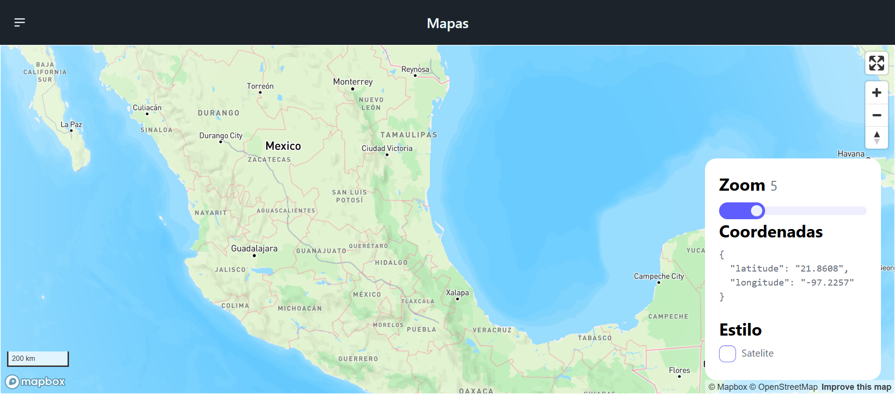
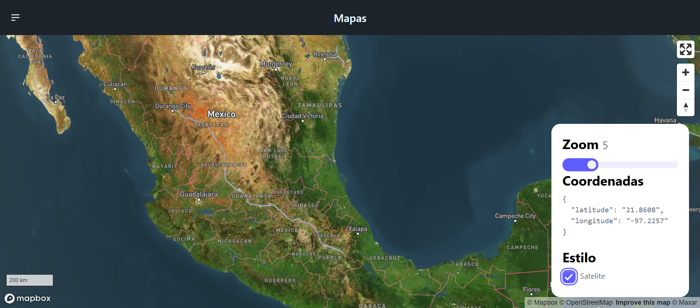
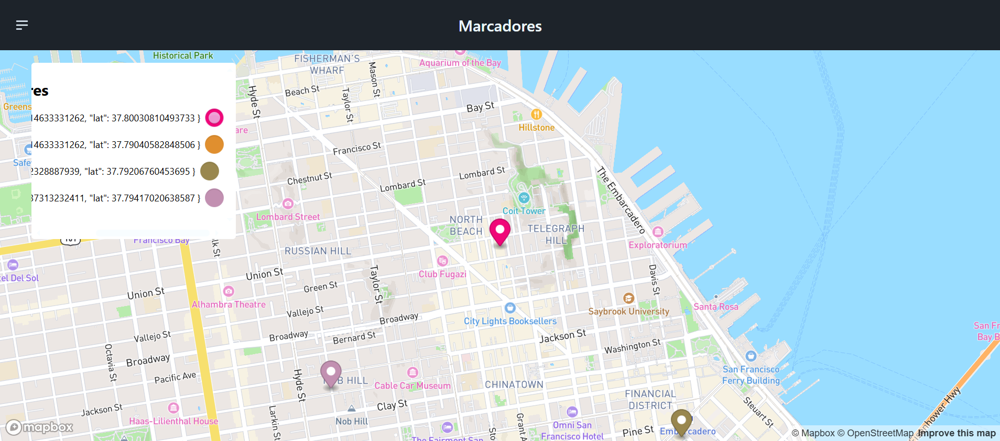
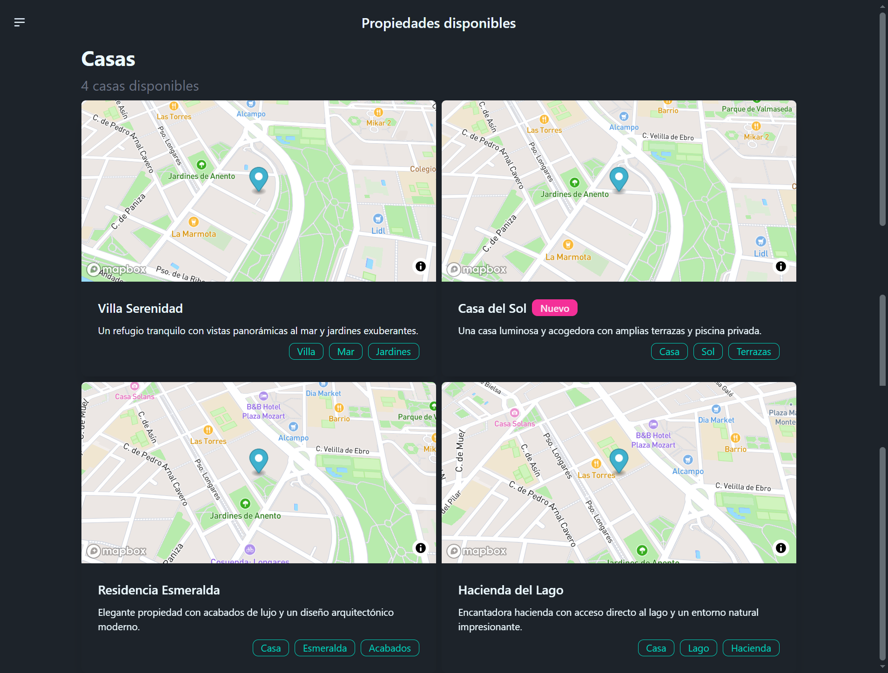

# MapAppAngular

<p align="center">
  &nbsp;
  
</p>

**MapAppAngular** plataforma de geolocalización usando la API **mapbox**. Hecho con **Angular** y para los estilos **Tailwind CSS** y **daisyUI**.

## Run Locally

Clone the project

```bash
  git clone https://github.com/miguel-camara/map-app-angular.git
```

Go to the project directory

```bash
  cd map-app-angular
```

Install dependencies

```bash
  npm install
```

Generate the `.env` based on the `.env.template`

Run the script

```bash
  npm run set-env
```

Start the server

```bash
  npm run start
```

## Environment Variables

To run this project, you will need to add the following environment variables to your **environment.ts** files

`MAPBOX_KEY`

## Demo

[Demo](https://mapas-miguel-camara.netlify.app/#/fullscreen)

## Screenshots









## Features

- **Map App:** Aplicación parecida a google maps usando la API de mapbox, los estilos de mapa prediseñados y los datos actualizados en tiempo real para crear mapas personalizables.
- **Inicio:** En esta sección se puede interactuar con el mapa en su forma predeterminada o en su forma de satélite, podemos hacer zoom. así como ver sus coordenadas.
- **Marcadores:** En esta sección podemos usar marcadores los cuales se van agregando en la tabla al hacer clic en el elemento de la tabla se hace una animación para volver a la posición del marcador en el mapa, para eliminar se hace doble clic sobre el elemento en la tabla.
- **Propiedades disponibles:** En esta sección se muestran tarjetas de ejemplo de casas en venta usando el mapa de forma estática.

## Tech Stack

**Frontend:** Angular, Tailwind CSS y daisyUI
