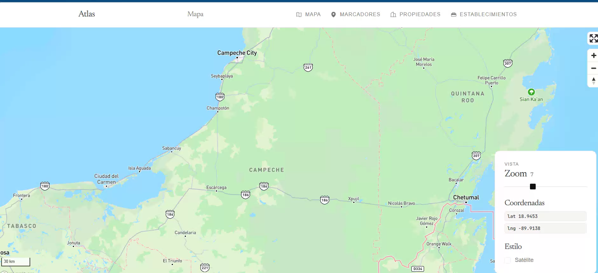
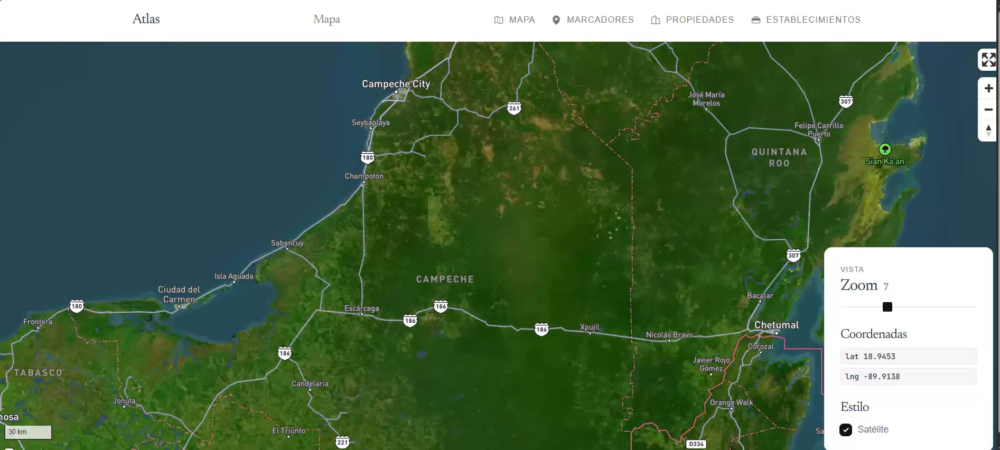
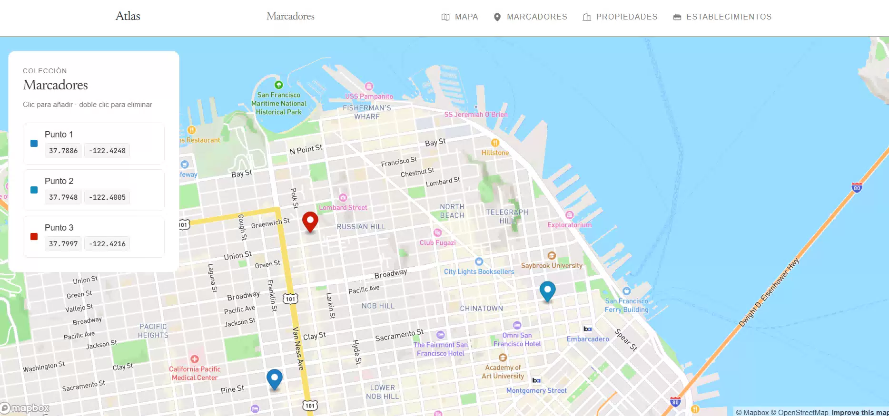
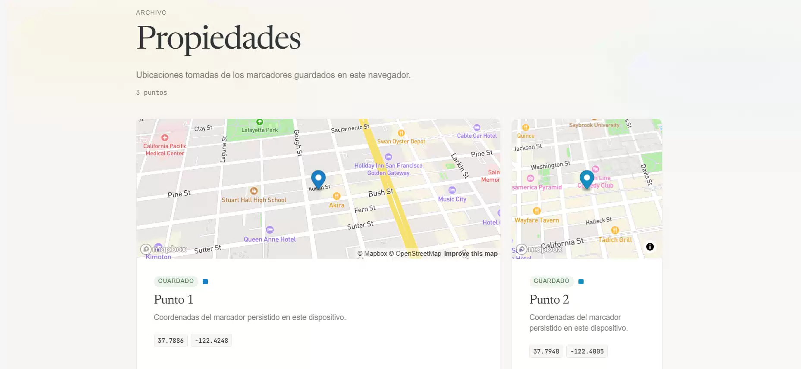
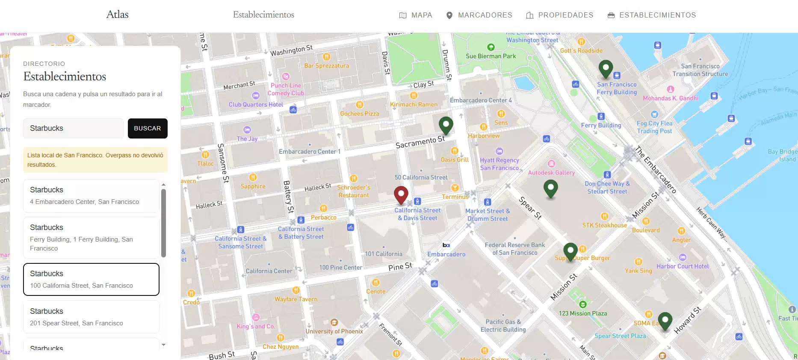

# Atlas

<p align="center">
  
  &nbsp;
  
  &nbsp;
  
</p>

<p align="center">
  Plataforma de <strong>mapas interactivos</strong> para navegador.<br />
  Explora ubicaciones, guarda marcadores y consulta establecimientos sobre Mapbox.
</p>

<p align="center">
  <a href="https://mapas-miguel-camara.netlify.app/#/fullscreen">Ver demo en vivo</a>
</p>

---

## Descripción

**Atlas** es una aplicación de geolocalización construida con Angular y la API de **Mapbox GL**. Ofrece cuatro vistas: un mapa a pantalla completa con controles de zoom y estilo, una sección para colocar marcadores persistentes, un listado de propiedades generado a partir de esos marcadores y una búsqueda de establecimientos comerciales.

La interfaz sigue un diseño editorial minimalista: tipografía Newsreader, fondo claro, paneles planos con bordes sutiles y animaciones de entrada discretas.

## Características

- **Mapa** — Vista a pantalla completa con zoom, coordenadas en tiempo real y alternancia entre estilo estándar y satélite.
- **Marcadores** — Clic en el mapa para añadir un pin con color aleatorio. Los marcadores se guardan en `localStorage` y persisten al recargar. Clic en la lista para volar al punto; doble clic para eliminar.
- **Propiedades** — Tarjetas generadas automáticamente a partir de los marcadores guardados, cada una con mini-mapa y coordenadas. Estado vacío con enlace a Marcadores si no hay puntos.
- **Establecimientos** — Búsqueda de locales (por defecto Starbucks) mediante la API **Overpass** de OpenStreetMap, sin clave. Si la API no responde, usa una lista local con coordenadas reales de San Francisco. Clic en un resultado para mover el mapa al pin.
- **Navegación editorial** — Barra superior con iconos Phosphor, menú compacto en móvil y títulos de página dinámicos.
- **Mini-mapas** — Componente reutilizable con vista estática, inclinación 3D y color de pin configurable.

## Rutas

| Ruta          | Título           | Descripción                                        |
| ------------- | ---------------- | -------------------------------------------------- |
| `/fullscreen` | Mapa             | Mapa interactivo a pantalla completa               |
| `/markers`    | Marcadores       | Colocar y gestionar marcadores persistentes        |
| `/houses`     | Propiedades      | Fichas de los marcadores guardados en el navegador |
| `/places`     | Establecimientos | Búsqueda de locales sobre OpenStreetMap            |

## Capturas











## Stack tecnológico

| Tecnología                                            | Versión |
| ----------------------------------------------------- | ------- |
| [Angular](https://angular.dev/)                       | 21      |
| [Mapbox GL JS](https://docs.mapbox.com/mapbox-gl-js/) | 3.22    |
| [Tailwind CSS](https://tailwindcss.com/)              | 4       |
| [TypeScript](https://www.typescriptlang.org/)         | 5.9     |
| [Overpass API](https://overpass-api.de/)              | —       |
| [uuid](https://www.npmjs.com/package/uuid)            | 14      |

**Patrones usados:** componentes standalone, Angular Signals, `HashLocationStrategy`, almacén reactivo con `localStorage`, `HttpClient` con fallback local.

## Estructura del proyecto

```
src/app/
├── maps/
│   ├── components/mini-map/   # Vista previa estática del mapa
│   ├── data/
│   │   └── starbucks-sf.ts    # Fallback local de establecimientos
│   ├── models/
│   │   ├── place.ts           # Modelo de establecimiento
│   │   └── saved-marker.ts    # Modelo serializable de marcador
│   └── services/
│       ├── markers.store.ts   # Persistencia de marcadores
│       └── places.service.ts  # Búsqueda Overpass + fallback
├── pages/
│   ├── fullscreen-map-page/   # Mapa a pantalla completa
│   ├── markers-page/          # Colocar y listar marcadores
│   ├── houses-page/           # Propiedades desde marcadores
│   └── places-page/           # Búsqueda de establecimientos
└── shared/
    ├── components/navbar/     # Navegación editorial
    └── directives/reveal.ts   # Animación de entrada al scroll
```

## Instalación local

Clona el repositorio:

```bash
git clone https://github.com/miguel-camara/map-app-angular.git
cd map-app-angular
```

Instala las dependencias:

```bash
npm install
```

Crea el archivo `.env` a partir de la plantilla y añade tu token de Mapbox:

```bash
cp .env.template .env
```

Genera los archivos de entorno:

```bash
npm run set-env
```

Inicia el servidor de desarrollo:

```bash
npm run start
```

Abre [http://localhost:4200](http://localhost:4200) en el navegador.

## Variables de entorno

| Variable     | Descripción                                                                   |
| ------------ | ----------------------------------------------------------------------------- |
| `MAPBOX_KEY` | Token de acceso de [Mapbox](https://console.mapbox.com/account/access-tokens) |

## Scripts disponibles

| Comando           | Descripción                                    |
| ----------------- | ---------------------------------------------- |
| `npm run start`   | Servidor de desarrollo con recarga en caliente |
| `npm run build`   | Build de producción                            |
| `npm run watch`   | Build en modo desarrollo con watch             |
| `npm run set-env` | Genera `environment.ts` desde `.env`           |
| `npm test`        | Ejecutar pruebas unitarias                     |

## Demo

🔗 [https://mapas-miguel-camara.netlify.app/#/fullscreen](https://mapas-miguel-camara.netlify.app/#/fullscreen)

## Autor

[Miguel Cámara](https://github.com/miguel-camara)
